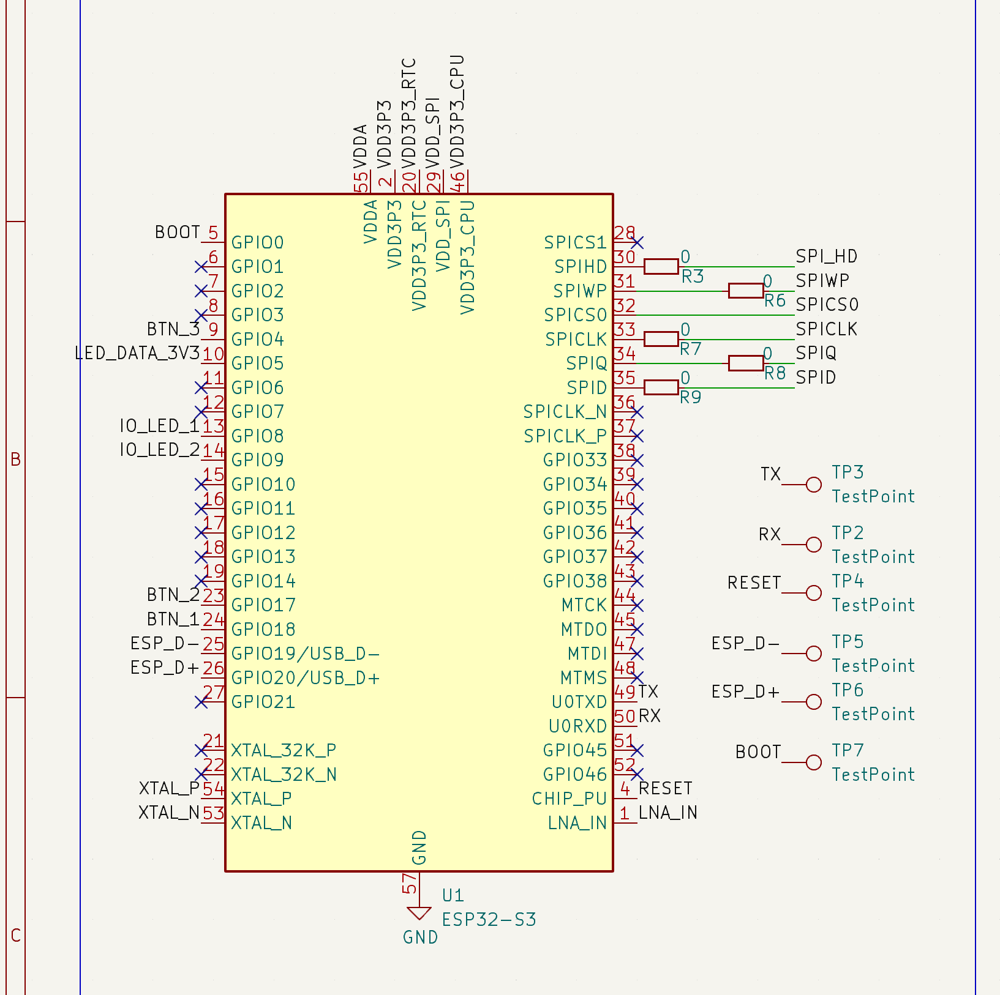

# PixelClick Rust

Hey! This is a playground for me to experiment with @brushknight's awesome PixelClick.

In this `master` branch, you can see the following areas covered:

- [x] Playing with the back LEDs (red and blue).
- [x] Playing with the front addressable LED panel.
- [x] Async programming with `embassy-rs`.
- [ ] Network functionality.

Come on! Go to [`src/main.rs`!](../src/main.rs)

## Pinout

This is the device pinout, in particular check for the `GPIO` labels inside the yellow square which represents the SoC and the labels associated with each of them. This show us what device is connected to each pin, so it's a matter of saying if we want to put a HIGH or a LOW  on each pin to achieve the effect we want!




## Develop with Dev Containers
This repository offers Dev Containers support, for developing quickly with VS Code.

> ### Why do we need this?
> The ESP32-S3 board uses an architecture that is not available as a target with the stock Rust toolchains (`xtensa-esp32s3-none-elf`). It requires a fork of the Rust compiler and LLVM to have this target available. This Dev Container sets up all these dependencies for you and configures Cargo to target this by default (see [`.cargo/config.toml`](../.cargo/config.toml)).

### Build the project
- Terminal approach (useful to quickly edit and add environment variables, just don't commit them if they're sensitive!):

    ```
    scripts/build.sh  [debug | release]
    ```
    > If no argument is passed, `release` will be used as default


-  UI approach:

    The default build task is already set to build the project, and it can be used
    in VS Code and GH Codespaces:
    - From the [Command Palette](https://code.visualstudio.com/docs/getstarted/userinterface#_command-palette) (`Ctrl-Shift-P` or `Cmd-Shift-P`) run the `Tasks: Run Build Task` command.
    - `Terminal`-> `Run Build Task` in the menu.
    - With `Ctrl-Shift-B` or `Cmd-Shift-B`.
    - From the [Command Palette](https://code.visualstudio.com/docs/getstarted/userinterface#_command-palette) (`Ctrl-Shift-P` or `Cmd-Shift-P`) run the `Tasks: Run Task` command and
    select `Build`.
    - From UI: Press `Build` on the left side of the Status Bar.

### Flash

If you, like me, use Colima for containers in a Mac and had issues exposing the serial device to the container, you can always develop and build the binary from the container and flash the board from outside. Make sure you install either `espflash` or `probe-rs`.

Once you have built your project with the script or `cargo build` or whatever, connect the device to the computer and, from the project's root directory use either:

```console
$  espflash flash --monitor target/xtensa-esp32s3-none-elf/release/<BINARY_NAME> 
```

or

```console
$ probe-rs run --chip esp32s3 target/xtensa-esp32s3-none-elf/release/<BINARY_NAME>
```

If you don't have this issue, you can just do the following:

- Terminal approach:
  - Using `flash.sh` script:

    ```
    scripts/flash.sh [debug | release]
    ```
    > If no argument is passed, `release` will be used as default

- UI approach:
    - From the [Command Palette](https://code.visualstudio.com/docs/getstarted/userinterface#_command-palette) (`Ctrl-Shift-P` or `Cmd-Shift-P`) run the `Tasks: Run Task` command and
    select `Build & Flash`.
    - From UI: Press `Build & Flash` on the left side of the Status Bar.
